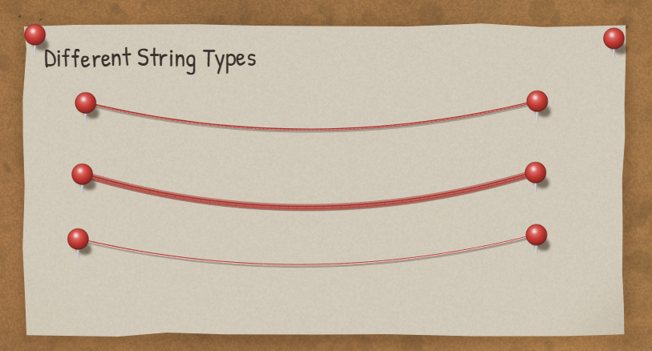
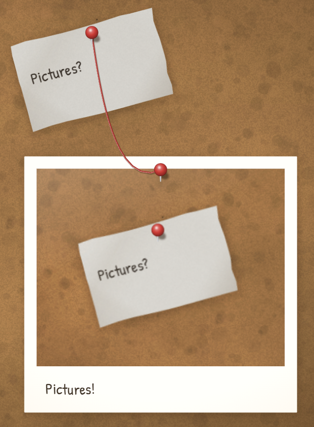
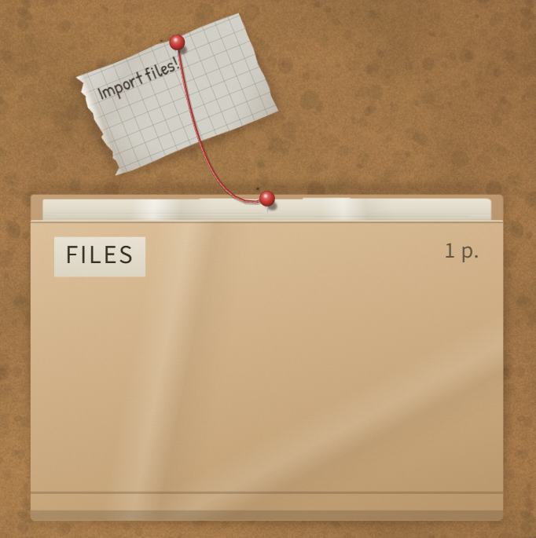
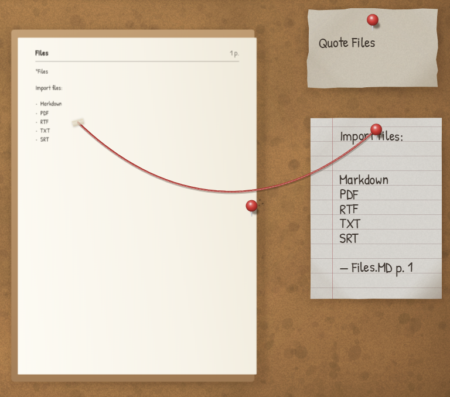
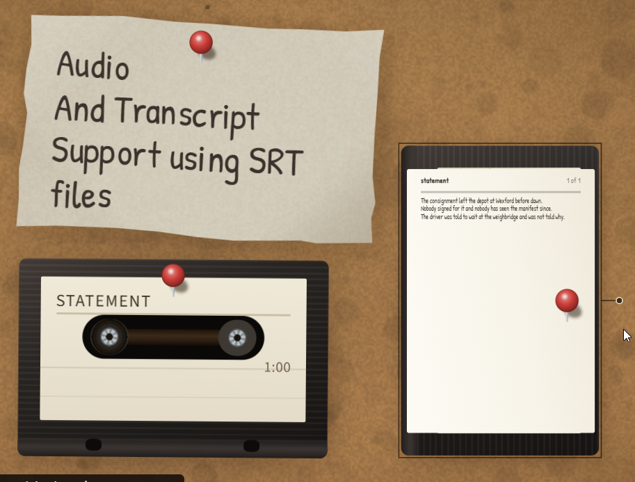
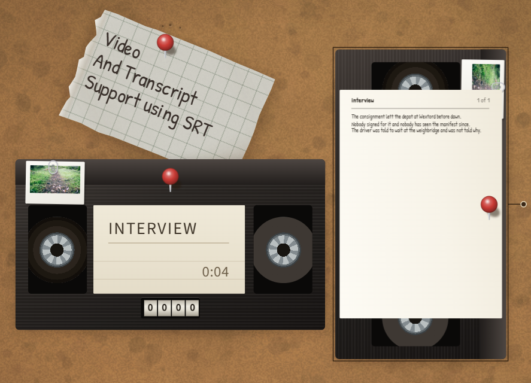
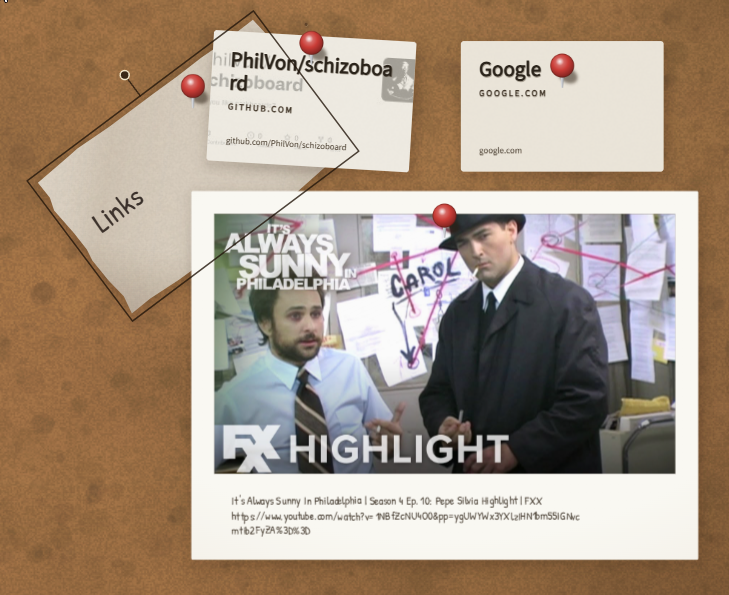
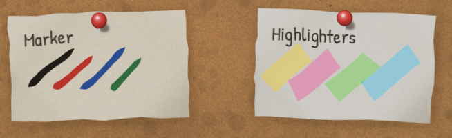
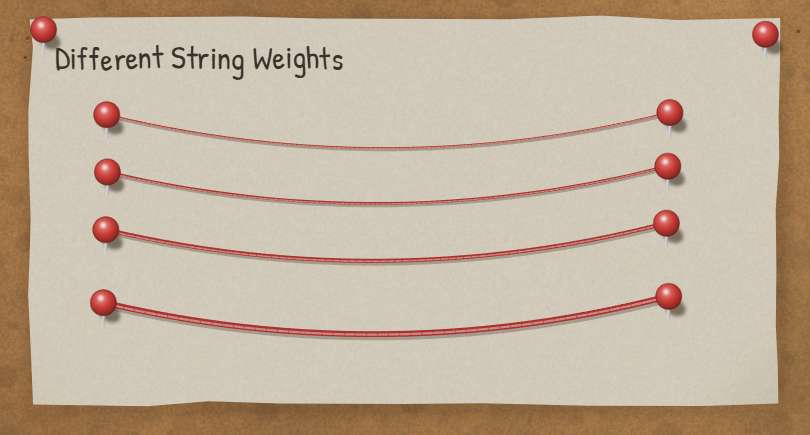

# Schizoboard

An infinite corkboard for organising information that hasn't decided what shape it is yet.

You know the board. It's in every conspiracy film: a wall of photographs and clippings and index cards, half of them annotated in marker, all of it connected by red string that someone ran between pushpins at three in the morning. It's a genuinely good thinking tool, and it survives in fiction because it works — it lets you hold a mess in your hands and find the shape by feel, rather than deciding the structure up front.

Schizoboard is that board. Paste a photo and it lands as a polaroid. Paste text and it lands on paper. Draw on any of it with a marker or a highlighter. Then run red string between the pins — pin to pin, through as many pins as you like, and when you want a new connection you grab the string mid-run and pull a fresh pin out of it.

The string sags under gravity, swings when you move a photograph, drapes over whatever it crosses, and settles. That matters more than it sounds: the moment string stops behaving like string, it becomes an arrow, and the whole thing collapses back into a flowchart.



---

## What lands on the board

Everything arrives the same way: **Ctrl+V**, or drop a file on the window. Nothing asks you what type it is — the bytes are sniffed and the board decides what the thing wants to be.

| You paste or drop | You get |
|---|---|
| An image (png, jpg, gif, webp, heic, …) | A polaroid with a hand-written caption |
| Text | A note — or a document, if it's too long for one |
| A document (pdf, docx, epub, md, txt, rtf, …) | A manilla case file: paginated, searchable, quotable |
| An audio file (mp3, flac, wav, ogg, …) | A cassette that plays in place |
| A video file (mp4, mkv, webm, mov, …) | A VHS tape that plays on a full-screen set |
| An `.srt`/`.vtt` beside a tape | A transcript, attached automatically and searchable |
| A link | The page's media if it has any, else a printed still or a business card |





Open a case file and it turns up on its side to be read. Select a passage — or drag a rectangle over a scan — and it becomes a quote card on the board, citing the page it came from.









## Marking it up

Four markers, four highlighters, an eraser and a smudge. Draw on the cork, on a photograph, on a page — the ink belongs to whatever you drew it on and moves with it.



String comes in six colours, three materials and any thickness, and every one of them hangs like it means it.



## Working the board

| | |
|---|---|
| **Space + drag** | pan |
| **Wheel** | zoom · **Ctrl+0** fits the board · **F** frames the selection |
| **V P S N M H E** | select, pin, string, note, marker, highlighter, eraser |
| **Ctrl+F** | find — notes, captions, inside documents, inside transcripts — and fly there |
| **Ctrl+Z / Ctrl+Y** | undo / redo |
| **Alt + drag a pin** | pull a new string out of it |
| **Ctrl+Alt + click a string** | scissors |
| **Enter / Escape** | open a case file or play a tape / put it back |

Right-click the cork for the board menu; right-click anything on it to restyle it, reorder it, or get the original file back byte-for-byte.

## Sharing a board

A board is a local `.schizo` file that saves itself continuously — no account, no server, no cloud. To share one:

- Peers on the same network **find each other automatically** (mDNS) and sync directly.
- **Copy invite link** puts a `schizo://` link on the clipboard; it carries the board's name and secret, not an address, so it keeps working when the host changes networks.
- Everyone works offline-first: edits merge when peers meet again (CRDT — Yjs underneath). Photographs travel peer-to-peer; until they arrive, the frame shows undeveloped film rather than blocking anything.

## Getting things out

- **Save a copy…** — the whole board as a single `.schizo` file, reopenable anywhere.
- **Export as PDF…** — handwriting comes out as real vector text, selectable in the PDF (Windows).
- **Export as an image…** — PNG or WebP, whole board or just the selection.

---

## Install

Grab the installer from the [latest release](https://github.com/PhilVon/schizoboard/releases/latest) and run it. Windows 10/11.

## Build from source

Prerequisites: [Node.js](https://nodejs.org/), [Rust](https://rustup.rs/), and the [Tauri v2 prerequisites](https://v2.tauri.app/start/prerequisites/) for your platform.

```sh
npm install
npm run tauri dev      # run it
npm run tauri build    # build the installer
npm run check          # lint, typecheck, tests
```

## Documents

| | |
|---|---|
| **[DESIGN.md](./docs/DESIGN.md)** | Vision, interaction, art direction, physics, rendering |
| **[DATA-MODEL.md](./docs/DATA-MODEL.md)** | The schema contract every other part depends on |
| **[ARCHITECTURE.md](./docs/ARCHITECTURE.md)** | Module boundaries, the frame loop, the native split, sync protocols |

## Shape of the thing

- **Tauri v2** desktop app — Rust shell, TypeScript frontend
- **Hybrid renderer** — DOM and CSS for items, canvas for string, one camera transform
- **Verlet rope**, seeded from an analytic catenary, asleep whenever nothing is moving
- **Yjs CRDT** over LAN peer discovery, so boards are collaborative and offline-first
- **Content-addressed assets**, never inside the document — an item is usable before its photograph arrives

## Design pillars

**Physical, not skeuomorphic.** Not a leather texture on a calendar — a small volume of the world with two-and-a-bit dimensions, one light source, and things that hang and swing.

**The string is the product.** Everything else is in service of getting string between things.

**Nothing blocks thinking.** No dialogs, no choosing a type, no naming things before you have them.

**Mess is a feature.** Nothing snaps to a grid. There is no auto-layout and there will never be a tidy-up button. A board that looks organised has stopped being useful.

## Licence

[Apache-2.0](./LICENSE). Bundled fonts (Patrick Hand, Source Sans 3) are under the [SIL Open Font License](./public/fonts/).
